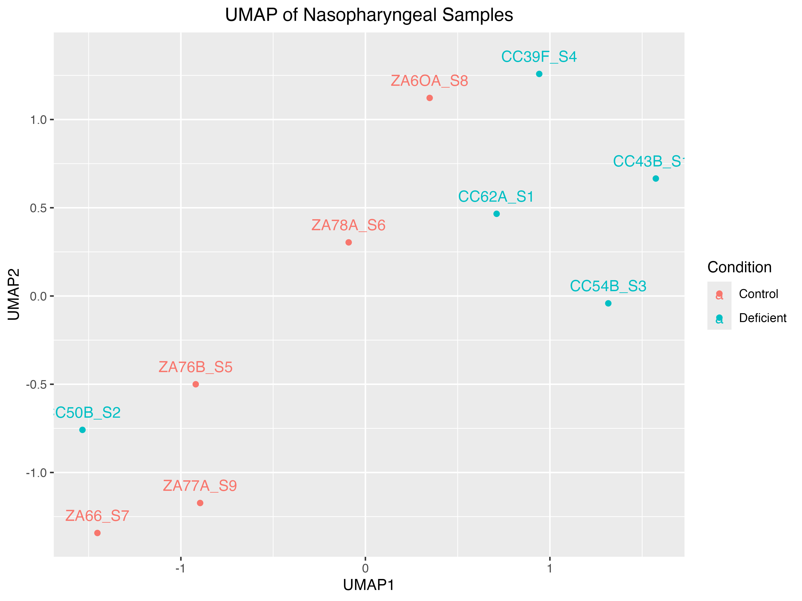

```{r setup, include=FALSE}
knitr::opts_chunk$set(echo = FALSE)
```

## Introduction

Meta-omic analysis of RNA-sequencing data investigating CVID across tissue samples

**Stakeholder**

-   Worked with W. Evan Johnson of Rutgers University

**Mission**

-   Deployed bioinformatic models to analyze diseases using genomic expression data

-   Focussed on **CVID**: a clinically defined disease, but which is molecularly not well-defined

-   Organized a complete code-base to support immunological research and publishability

## Context

This analysis is subsequent to work of Dr. Paul Maglione : '*Convergence of cytokine dysregulation and antibody deficiency in common variable immunodeficiency with inflammatory complications*' :

-   Preceding study involved LPS stimulation of peripheral blood tissue and identified "potential significance of reduced LPS-specific antibodies"... "suggesting a a 2-hit model of pathogenesis requiring further exploration"

## Local and Global Impact

We hope our analysis will contribute as support system and a viewpoint on :

**Locally**

-   Building a code repository that is useful both as a tool and evidence supporting publishable results
-   Supporting research of Drs. W. Evan Johnson of Rutgers and P.J. Maglione of Boston U.

**Globally**

-   Expanding understanding of less understood immunological topic, contributing to body of evidence

-   Supporting the immunological research community and hopefully providing a data point one day improving care

## Continuing Professional Development

*More than 5 topics outside of the curriculum were discussed or needed for project completion:*

-   **Jaccard Coefficient** for similarity analysis
-   **Permutation Tests** for analysis design validation
-   Bioinformatics pipelines for Differential Expression Analysis and Pathway Analysis *(Summarized Experiment, DESeq2, Limma, and enrichR Libraries)*
-   Introductory Immunology and Clinical Practices
-   Professional Academic Journal Writing

## Data Science Lifecycle

1.  Data acquisition and representativeness
2.  Data management
3.  Data preparation and integration
4.  Data analysis
5.  Model development and deployment
6.  Visualization and communication of the knowledge obtained from the data

## 1. Data acquisition and representativeness

Dr Johnson provided 3 separate data sets directly. These were developed or measured by research teams at Boston University and Rutgers:

1.  Nasopharynx sampling of controls and CVID-diagnosed patients
2.  Peripheral Blood Mononuclear Cell samples (white blood cells found in bloodstream) for controls and CVID
3.  Nasal and Blood samples from patients either control or living with Tuberculosis

**As with other genomic studies, this analysis was subject to problem of "small N big P"**

{width=600px style="display: block; margin-left: auto; margin-right: auto;"}

## 2. Data management

-   We learned and used the Summarized Experiment (S4) data structure. This packages count data with patient metadata into a single object.

-   Patient anonymity was a key priority and maintained throughout.

-   Maintaining separate databases while sharing versions through Git  to prevent leaking sensitive data.


{width=500px style="display: block; margin-left: auto; margin-right: auto;"}

## 3. Data preparation and integration


-   General data cleaning *(renaming variables, filtering outliers, splitting datasets)*

-   Augmented the data by converting gene expression counts into: counts per million (CPM), log-counts, and log-CPM

-   Moderate EDA performed to identify and label appropriate treatment groups


## 4. Data analysis

-   Dimensionality reduction by PCA (axial) and UMAP (maintaining distances)

-   DESeq2 model deployed to identify significant genes. DESeq uses negative binomial regression to model count data, which estimates variance and accounts for over dispersion. For gene $i$ in sample $j$, the observed count $K_{ij}$ follows a negative binomial distribution with mean $\mu_{ij}$ and gene-specific dispersion parameter $\alpha_i$:

$$
K_{ij} \thicksim NB(\mu_{ij}, \alpha_i)
$$

-   Pathway analysis using *enrichR* provided databases to cross reference the statistically significant genes against known cellular pathways (collection of genes). This enables interpretation of DESeq results using curated biological knowledge.

-   Comparative analysis using **Jaccard coefficient** statistic and **permutation tests** to validate the design of our analysis.

## 5. Model development/deployment

Model development wasn't the goal of this project. While we used DESeq models, they were used for inference.

**Theoretical model development:** 

-   Leverage the significant genes to create a classification model to predict whether a patient has CVID or not

-   Choose among the multitude of classification models *(Naive Bayes seems like a good candidate)*

-   Train and test the model

-   Diagnose the model using accuracy, confusion matrix (and derivatives), and kappa


## 6. Communication of Knowledge Obtained from Data

-   Creation of subject appropriate statistical plots : UMAP plots, Heatmaps, Volcano plots

-   Adjusting figures for publication-readiness

-   Rslidy for clear and concise presentation, transmission of results

-   Journal-appropriate writing, in particular for *Methods* section

{width=600px style="display: block; margin-left: auto; margin-right: auto;"}

## Non-technical Discussion

*More than one of legal, professional, ethical, security, or social issues were discussed in depth:*

1.  Samples are described with metadata for statistical analysis, but must be separately analyzed for discretion around patient anonymity
2.  The social **ethics of designations and sensitive usage** were discussed: Ugandan data included **patients living with HIV**. Diagnosis of Tuberculosis may warrant similar sensitivities.
3.  Presently **evolving landscape of clinical research and public funding** were discussed with Dr. Johnson, including professional practices and current risks

## Development Methodology

::::: columns
::: column
***Methodology***

-   Worked: 
    - Version control and colaboration through GitHub
    - Regular meetings with our stake holder (Dr Johnson)
    - Mostly organized file structure

-   Didn't Work: 
    - Lack of a consistent coding syntax resulting in shifting styles
    - Duplicate files among several folders
    
:::

::: column
***Teamwork***

-   Worked: 
    - Different skill-sets
    - Largely clear task division
    - Multi-channel communication

-   Didn't Work: 
    - Occasional time conflicts from multiple schedules
    - Skill-set differentials
:::
:::::

## Outside Classes

What math and Data Science classes were used in the project?

::::: columns
::: column
**Math Courses**

-   MATH 3700: General Statistical Knowledge
-   MATH 2170: Matrix Mastery and Introduction to Dimension Reduction
-   MATH 3150: Introduction to linear models and advanced statistics
-   MATH 3190: Advanced R and Rmd
:::

::: column
**Support Courses**

-   ANLY 4100: Data Visualization
-   ANLY 4110: Advanced Data Visualization
-   CSCY 2400: Ethical Data Issues
-   CS 2420: Data Structures Basics
-   BIOL 3060: Genetics background
:::
:::::

## Conclusion

**Stakeholder Communication:** 

-   Gained experience in presenting progress, gathering feedback, and making changes to our work. 

**New Industry & Tools:**

-   Developed familiarity with common bioinformatics workflows and the unique challenges of clinical genomic data.

-   Gained hands-on experience with tools like DESeq2, enrichR, and SummarizedExperiment.

**Impact:**

-   Contributed with ongoing research of complex diseases like CVID, and demonstrate the potential of data science to inform clinical discovery.


## Thank you
{width=1000px style="display: block; margin-left: auto; margin-right: auto;"}
